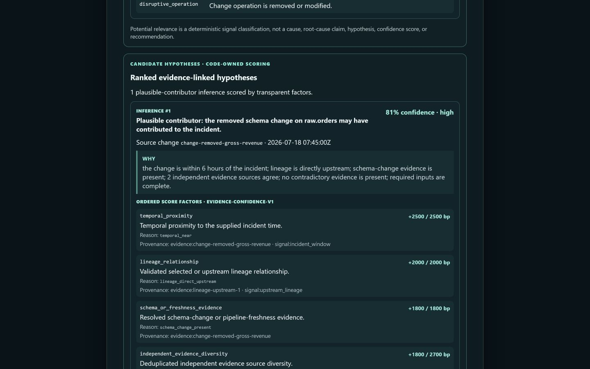

# Data Incident Investigator

[](LICENSE)

**An evidence-first investigation agent for data incidents.**

When a metric changes unexpectedly, the clues are usually split across catalog metadata, lineage,
schema history, pipelines, and dashboards. Data Incident Investigator turns one incident question
into a structured report that keeps retrieved facts, evidence-linked inferences, assumptions,
missing information, blast radius, and recommended human checks separate.

[Try the public fixture demo](https://data-incident-investigator-1071683558688.asia-southeast1.run.app)
· [Judge quickstart](docs/JUDGE_QUICKSTART.md) ·
[2:50 functioning demo](https://youtu.be/D5mvMqrhyDc) ·
[Screenshot gallery](docs/demo-assets/README.md) ·
[Public repository](https://github.com/toannnnq1424/data-incident-investigator)

## See the canonical result

The public demo is credential-free and uses synthetic fixture data:

1. Wait for **Fixture metadata · Ready**.
2. Under **What changed?**, choose **Removed schema column**.
3. Keep the populated synthetic fields and choose **Start investigation**.
4. After **Investigation completed**, inspect the ranked hypothesis, evidence, blast radius, and
   **Download Markdown report** link.



The canonical result identifies the removed `gross_revenue` column on upstream `raw.orders` as a
**plausible contributor**, not a confirmed cause. Its `81% · high` confidence is the exact sum of
bounded, visible, code-owned evidence factors. The report traces two supported downstream impacts,
links every hypothesis and impact back to evidence IDs, and labels every recommendation
`not_executed`.

## How it works

1. Shared Zod contracts validate and normalize the incident intake.
2. A provider-neutral metadata adapter searches entities, expands bounded lineage, and requests
   recent metadata changes when the selected provider supports them.
3. Deterministic orchestration classifies suspicious changes and ranks evidence-linked hypotheses.
4. API-owned analysis calculates transparent confidence and a bounded downstream blast radius.
5. React renders the report, observable activity, limitations, and a sanitized deterministic Markdown
   export.

| Layer                  | Technology and responsibility                                                |
| ---------------------- | ---------------------------------------------------------------------------- |
| Judge interface        | React 19 and Vite 7                                                          |
| HTTP service           | Fastify 5 on Node.js 24                                                      |
| Contracts              | Zod 4 schemas shared by web, API, adapters, and reports                      |
| Metadata               | Fixture, direct DataHub GraphQL, or bounded DataHub MCP Server adapter       |
| Investigation          | Deterministic TypeScript orchestration; zero model calls                     |
| Quality                | Vitest, TypeScript, ESLint, Prettier, browser regression, and GitHub Actions |
| Public fixture hosting | One same-origin Google Cloud Run service with process-local synthetic data   |

Fixture mode is deterministic for fixed inputs. Live DataHub inputs and provider state can vary.

## DataHub integration: validated against local DataHub OSS, not live in the public demo

The repository contains two DataHub-backed adapter paths:

- `APP_MODE=datahub` uses an authorized DataHub GraphQL endpoint.
- `APP_MODE=datahub-mcp` uses the official MCP TypeScript SDK over an operator-provided Streamable HTTP
  endpoint. It discovers and calls only read-only `search` and `get_lineage`, bounds time/bytes/entity
  counts, and never falls back silently to fixtures.

On 2026-07-28, the MCP path also passed a localhost-only integration against DataHub Core `1.6.0`
loaded with the official synthetic ecommerce data pack and official `mcp-server-datahub` `0.6.0`.
Mutation, user, and data-quality tools were disabled. The application passed MCP-backed readiness,
search, bounded lineage, and explicit unsupported recent-change handling. One bounded incident
returned the designed degraded result when lineage was truncated and recent-change history was
unavailable; it did not invent a root cause.

That real local OSS proof is **PASS — LOCAL OSS**. It also exposed an official nested lineage
`platform` descriptor that the adapter now accepts under the existing bounded entity schema. It is
not a durable remotely reachable endpoint: no DataHub Cloud tenant, public tunnel, or judge credential
was created. The entrant reports that a DataHub hackathon representative confirmed that the intended
hackathon path is DataHub OSS locally and answered **yes** when asked whether the credential-free
Public fixture demo plus the reproducible local OSS/MCP path satisfies access and integration
expectations without remote DataHub/MCP hosting. This records general organizer guidance, not
submission acceptance or a judging result. The public Cloud Run service remains fixture-only.

### Optional authenticated local OSS path

DataHub Core can also protect the local MCP-to-GMS hop with a PAT. The current official
[Metadata Service Authentication](https://docs.datahub.com/docs/authentication/introducing-metadata-service-authentication)
and [PAT](https://docs.datahub.com/docs/authentication/personal-access-tokens) docs say authentication
is opt-in and must be enabled for both GMS and the frontend. Keep a private copy of the
[quickstart](https://docs.datahub.com/docs/quickstart) Compose file, set
`METADATA_SERVICE_AUTH_ENABLED: 'true'` for
`datahub-gms-quickstart` and `datahub-frontend-quickstart`, then restart from that copy:

```bash
cp ~/.datahub/quickstart/docker-compose.yml ~/datahub-auth-compose.yml
# Edit ~/datahub-auth-compose.yml; never commit this operator-owned file or a generated token.
datahub docker quickstart --stop
datahub docker quickstart --quickstart-compose-file ~/datahub-auth-compose.yml
```

Sign in to local DataHub, open **Settings → Access Tokens**, generate a PAT, and expose it only to the
self-hosted MCP process as `DATAHUB_GMS_TOKEN`; keep `DATAHUB_GMS_URL` pointed at local GMS. The app
still connects to the trusted loopback MCP endpoint with `DATAHUB_MCP_AUTH_MODE=none`, so the PAT must
never enter the frontend, repository, screenshots, logs, or `DATAHUB_TOKEN`. The unauthenticated
localhost proof described above remains the actually executed evidence; this PAT recipe is a
documented optional hardening path.

## Local judge fallback

Requirements: Node.js 24 or newer and pnpm `11.9.0` exactly. Fixture mode requires no external
credential.

Windows PowerShell:

```powershell
git clone https://github.com/toannnnq1424/data-incident-investigator.git
Set-Location data-incident-investigator
& .\scripts\bootstrap-worktree.ps1
Copy-Item .env.example .env
pnpm dev
```

macOS/POSIX:

```bash
git clone https://github.com/toannnnq1424/data-incident-investigator.git
cd data-incident-investigator
. ./scripts/bootstrap-worktree.sh
cp .env.example .env
pnpm dev
```

Open `http://localhost:5173`, then follow the same **Removed schema column** flow. API liveness and
readiness are available at `http://localhost:3001/health` and `http://localhost:3001/ready`.

For the shortest verified path and expected labels, use the
[judge quickstart](docs/JUDGE_QUICKSTART.md).

## Truthful limitations

- The public service is credential-free **fixture mode**, not live DataHub evidence.
- Current source exposes seven incident playbooks, but only **Removed schema column** has the rich
  checked-in metadata/incident fixture and canonical browser flow. Until this source revision is
  separately deployed, the Public service retains the earlier compact scenario selector.
- Incident state is process-local and disappears on restart or scale-to-zero; incident URLs are not
  durable.
- Confidence is deterministic evidence scoring, not a probability from an LLM. The current workflow
  makes zero model calls and does not read `OPENAI_API_KEY`.
- Recommendations are proposals for human review. The app does not modify DataHub, schemas,
  pipelines, dashboards, or production data.
- Blast-radius status is always bounded and explicit. `partial`, `unknown`, or `unavailable` must not
  be read as verified zero impact.
- The owner-authorized Cloud Run operating window now runs through **2026-09-17 23:59 ICT**,
  beyond the 2026-08-31 judging end. A 20%-remaining-credit signal triggers monitoring and owner
  escalation rather than an automatic pre-judging stop; emergency security or uncontrolled-billing
  response remains possible. The Public repository quickstart remains the durable fallback.
- Devpost registration, individual **Join Hackathon**, and the entrant-operated final submission are
  complete for project `1117401`. The signed-in finalization screen reports **Project submitted!**,
  **Submitted**, and **5/5**; the public project page is
  <https://devpost.com/software/data-incident-investigator>. The entry retains **Open / Wildcard**,
  the Public app/repository/video links, five real fixture screenshots with English captions, a
  completed-report thumbnail, and truthful English project/judge copy. This records submission state,
  not organizer acceptance, eligibility approval, prize status, or an independent repository
  attestation of the entrant's ownership and rights facts.

## Validation and project documentation

Use targeted commands during a slice and `pnpm validate` only at a phase/release checkpoint:

```bash
pnpm format:check
pnpm lint
pnpm typecheck
pnpm test
pnpm build
pnpm smoke
```

Architecture and contracts are documented in [docs/ARCHITECTURE.md](docs/ARCHITECTURE.md),
[docs/AGENT_DESIGN.md](docs/AGENT_DESIGN.md), and
[docs/API_CONTRACTS.md](docs/API_CONTRACTS.md). Deployment/provenance and its cost boundary are in
[docs/DEPLOYMENT.md](docs/DEPLOYMENT.md).

Licensed under the [Apache License 2.0](LICENSE).
