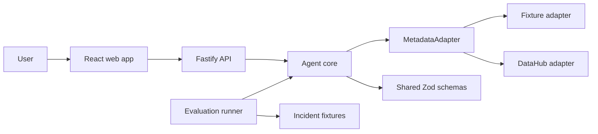

# Architecture

## System shape

The project is a TypeScript monorepo with a web app, HTTP API, investigation core, metadata adapters,
shared schemas, fixtures, and evaluation tooling.

## Package responsibilities

- `apps/web`: incident input, progress, report, evidence, lineage, blast radius, and actions.
- `apps/api`: validation, incident lifecycle, orchestration entrypoints, health, and error mapping.
- `packages/shared-types`: runtime schemas and public internal contracts.
- `packages/datahub-client`: DataHub transport and the provider-neutral metadata adapter contract.
- `packages/agent-core`: bounded investigation workflow, hypothesis/evidence assembly, and
  deterministic downstream blast-radius traversal.
- `packages/evaluation`: deterministic cases, metrics, and report generation.

## Dependency direction

`shared-types` is dependency-free except for Zod. `datahub-client` depends on shared types. `agent-core`
depends on shared types and the metadata adapter. Apps depend inward on contracts/core; packages never
depend on apps. Evaluation depends on public internal contracts, not UI rendering.

## Runtime modes

- Fixture: seeded metadata, lineage, and changes; stable for tests and demos.
- DataHub: HTTP/GraphQL client translates DataHub responses into internal types.

Switching adapters must not change investigation business logic or API output.

Blast-radius analysis reuses the provider-neutral normalized lineage graph and existing runtime depth,
entity, tool-call, and deadline limits. It adds no provider, connector, retry path, storage, or fallback
dataset. The API runs it after deterministic hypothesis scoring and before remediation planning, then
validates the combined public report through the shared schema.

## Trust boundaries

User input, provider responses, and model output are untrusted. Validate at the API boundary and again
before rendering a final report. Credentials stay in process environment and provider-specific logs are
sanitized. External design tools such as Stitch assist design only and are not production dependencies.
Blast-radius paths and IDs come only from schema-validated lineage plus existing scored
hypothesis/evidence references. Provider labels are normalized as untrusted display text; status copy
and coverage reasons are code-owned and contain no raw metadata or model prose.

## Deployment target

The initial deployment remains one web artifact and one stateless API process. Persistent incident
storage is deferred; MVP state may be in-memory or fixture-backed. This avoids premature service
decomposition while leaving adapter and storage seams explicit.
