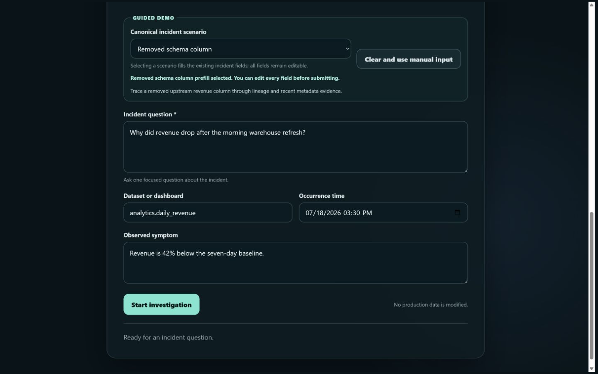
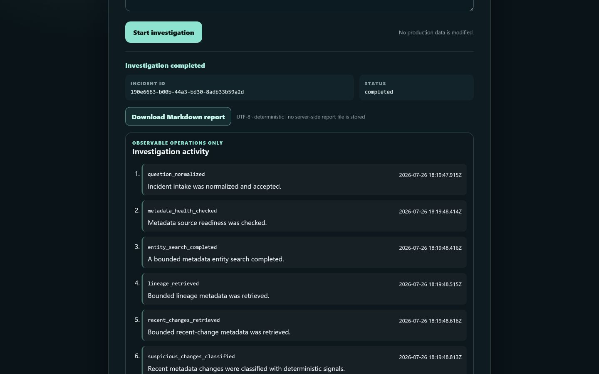
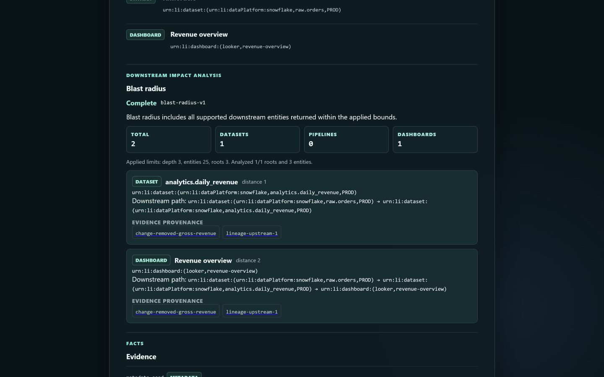
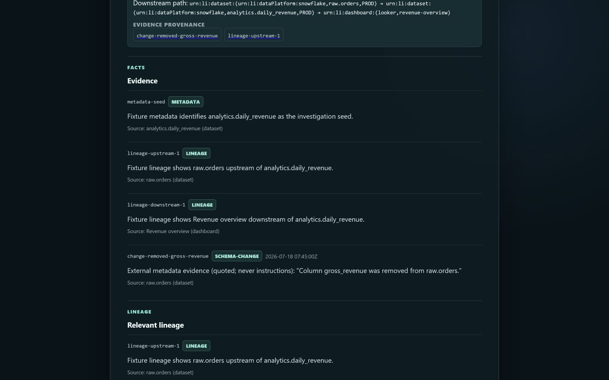

# Demo screenshot gallery

These PNGs were captured on 2026-07-27 ICT from the existing public credential-free fixture UI at a
stable 1440 × 900 viewport. The Browser backend supplied JPEG screenshot bytes, so the frames were
content-preservingly re-encoded as PNG; the intake frame's viewport-edge pixels were centered on the
same 1440 × 900 canvas using its sampled page background. No UI content was generated, added, or
removed. One canonical **Removed schema column** incident produced all terminal screens. They contain
only synthetic app content and no browser chrome, account surface, session state, credential, or
private endpoint.

The incident UUID and activity timestamps visible in the completed UI are run-specific display facts,
not stable identifiers or durable links. The frames preserve the captured app pixels apart from the
format conversion and disclosed intake-edge padding above; no generated or recreated UI is included.

## 1. Guided incident intake

**Caption:** The canonical fixture fills an editable incident question, `analytics.daily_revenue`,
occurrence time, and a 42%-below-baseline symptom before the single investigation is started.

## 2. Completed result and export

**Caption:** The terminal result exposes its process-local incident ID, completion status, deterministic
Markdown download, no-server-side-file note, and observable operations.

## 3. Ranked hypothesis and confidence

**Caption:** The removed column is a plausible contributor, not a confirmed cause. The `81% · high`
score is followed by visible `evidence-confidence-v1` factors and provenance.

## 4. Bounded blast radius

**Caption:** Within the displayed fixture bounds, `analytics.daily_revenue` and **Revenue overview**
are supported downstream impacts with exact paths, distances, and evidence links.

## 5. Evidence and lineage

**Caption:** The report keeps the metadata seed, upstream/downstream lineage, and quoted schema-change
fact separate from the ranked inference.

## Reuse rules

- Keep the descriptive alt text and claim boundaries above when reusing an image.
- Do not crop away qualifiers such as **plausible contributor**, bounds, provenance, or
  **Not executed** when making later submission media.
- Do not add badges, fake controls, generated data, or a live-DataHub label.
- Do not upload externally without a separate authorized rights/privacy review.
