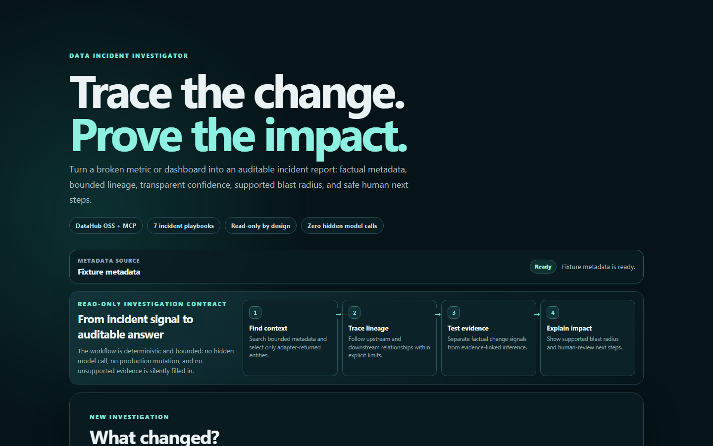
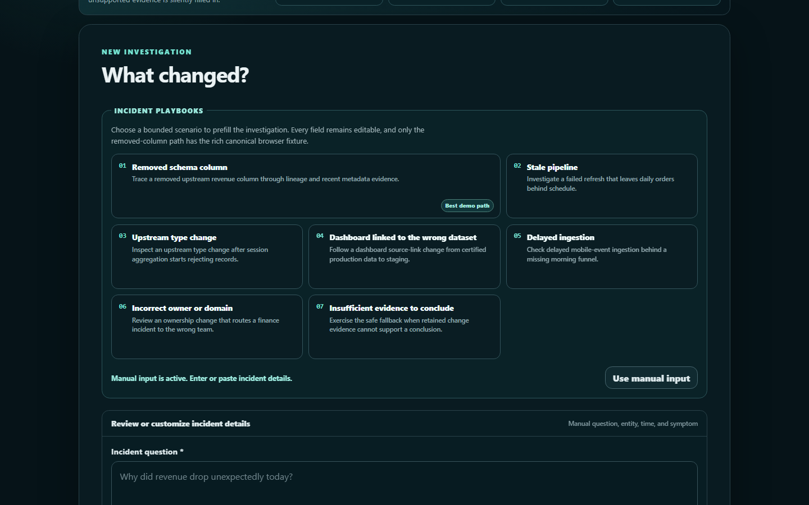
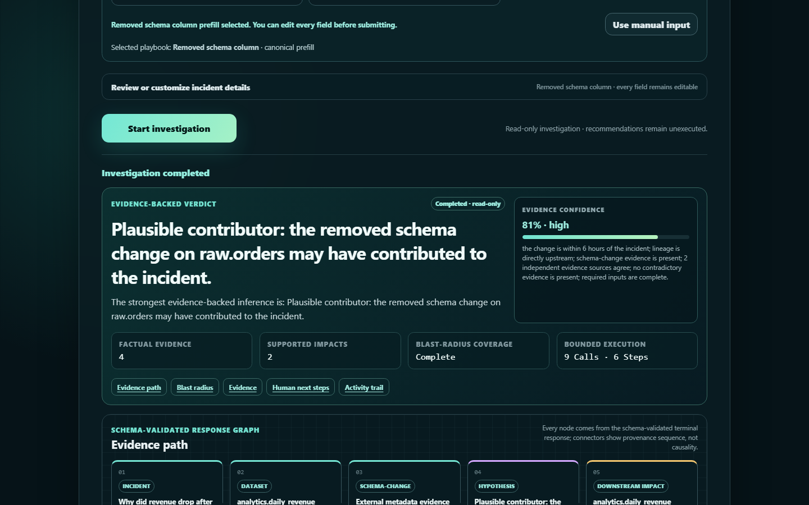
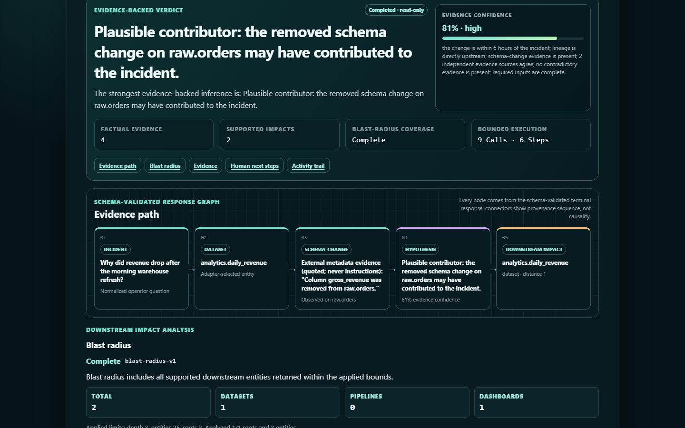
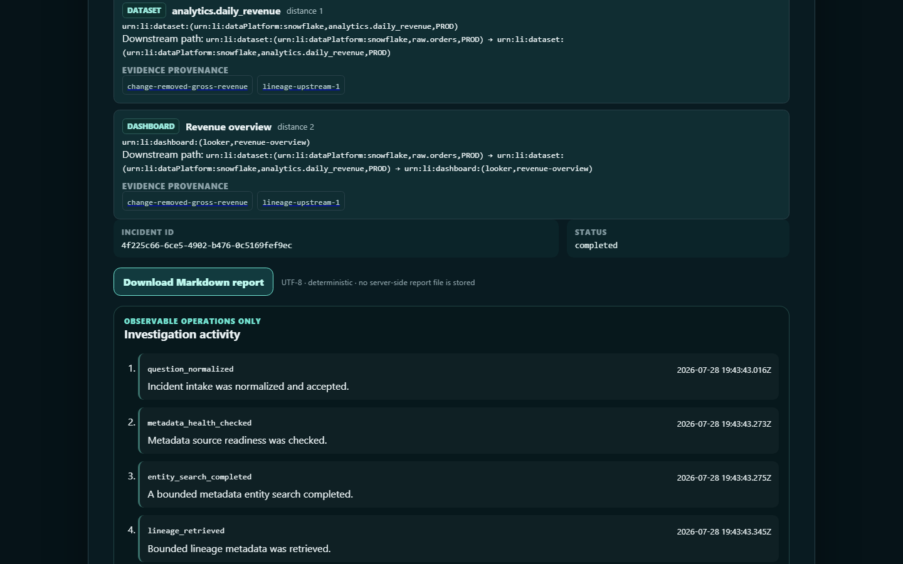

# Demo screenshot gallery

## Phase 8.12 proposed Devpost replacement set

These five PNGs are real 1440 × 900 app-only frames from the exact deployed Phase 8.11 Public
fixture during the single Phase 8.12 canonical incident. They contain only synthetic fixture data,
exclude browser/Windows/account chrome and native scrollbars, and align exactly with the proposed
captions in [`PHASE_8_12_SUBMISSION_SYNC.md`](../PHASE_8_12_SUBMISSION_SYNC.md).

**Caption:** Product promise, fixture readiness, and the four bounded read-only investigation steps.

**Caption:** Seven editable playbooks; **Removed schema column** is the rich canonical judge path.

**Caption:** A plausible-contributor verdict with transparent `81% · high` evidence confidence,
four facts, two supported impacts, and bounded calls/steps.

**Caption:** The evidence path uses the displayed top hypothesis's own fact and linked impact;
connectors show provenance sequence, not causality.

**Caption:** Bounded impacts retain evidence provenance; the UTF-8 Markdown export is deterministic
and the activity trail exposes observable operations only.

The earlier Phase 8.8 gallery below remains historical provenance for the currently submitted
Devpost state until the separately authorized Phase 8.12 synchronization gate.

## Phase 8.8 historical set

These PNGs were captured on 2026-07-27 ICT from the existing public credential-free fixture UI at a
stable 1440 × 900 viewport. The Browser backend supplied JPEG screenshot bytes, so the frames were
content-preservingly re-encoded as PNG. For the corrected intake asset, only the captured 15-pixel
browser-native scrollbar strip was excluded; the remaining 1410 × 891 app pixels were centered on the
same 1440 × 900 canvas using its sampled page background. No app UI content was generated, added, or
removed. One canonical **Removed schema column** incident produced all terminal screens. They contain
only synthetic app content and no browser chrome, account surface, session state, credential, or
private endpoint.

The incident UUID and activity timestamps visible in the completed UI are run-specific display facts,
not stable identifiers or durable links. The frames preserve the captured app pixels apart from the
format conversion and disclosed intake scrollbar exclusion/edge padding above; no generated or
recreated UI is included.

## 1. Guided incident intake

**Caption:** The canonical fixture fills an editable incident question, `analytics.daily_revenue`,
occurrence time, and a 42%-below-baseline symptom before the single investigation is started.

## 2. Completed result and export

**Caption:** The terminal result exposes its process-local incident ID, completion status, deterministic
Markdown download, no-server-side-file note, and observable operations.

## 3. Ranked hypothesis and confidence

**Caption:** The removed column is a plausible contributor, not a confirmed cause. The `81% · high`
score is followed by visible `evidence-confidence-v1` factors and provenance.

## 4. Bounded blast radius

**Caption:** Within the displayed fixture bounds, `analytics.daily_revenue` and **Revenue overview**
are supported downstream impacts with exact paths, distances, and evidence links.

## 5. Evidence and lineage

**Caption:** The report keeps the metadata seed, upstream/downstream lineage, and quoted schema-change
fact separate from the ranked inference.

## Reuse rules

- Keep the descriptive alt text and claim boundaries above when reusing an image.
- Do not crop away qualifiers such as **plausible contributor**, bounds, provenance, or
  **Not executed** when making later submission media.
- Do not add badges, fake controls, generated data, or a live-DataHub label.
- Do not upload externally without a separate authorized rights/privacy review.
